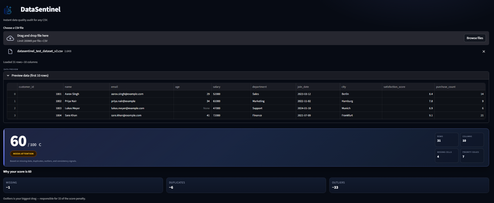
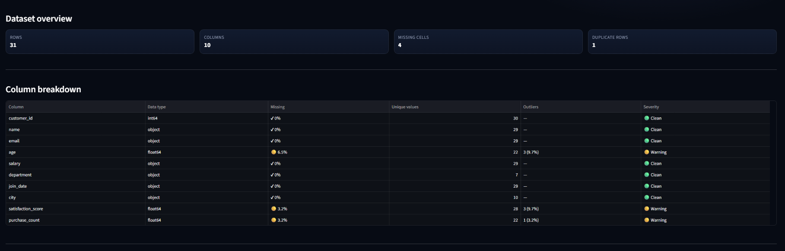
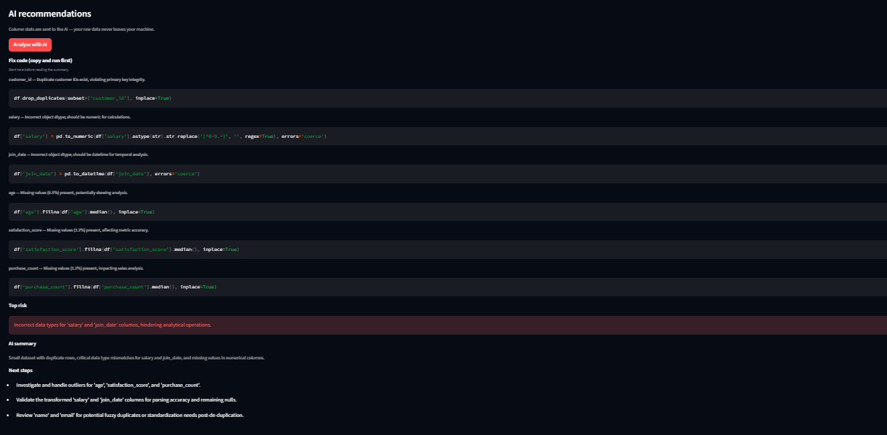

# DataSentinel

DataSentinel is a Streamlit-based data quality auditing app for CSV datasets. It helps users quickly inspect dataset health, detect common quality issues, and generate actionable cleanup suggestions.

**Live Demo:** [Try DataSentinel](https://data-sentinel-vdbjrmxm7jwuauxsdjqgb4.streamlit.app/)

## Overview

Real-world datasets are often messy before any analysis or machine learning work can begin. Missing values, duplicate rows, outliers, invalid email fields, and inconsistent columns can reduce trust in the data and lead to poor downstream decisions.

DataSentinel provides a lightweight audit workflow for CSV files. It profiles the dataset, computes a rule-based health score, highlights high-priority issues, shows column-level diagnostics, and generates AI-assisted recommendations to help users understand what to fix first.

## Why I Built This

I built DataSentinel to make initial data quality checks faster and easier to understand, especially for users working with raw CSV exports. Instead of manually inspecting each column or writing repeated cleaning scripts from scratch, the app gives a quick overview of dataset health and surfaces the most important problems in one place.

## What It Does

- Upload and analyze CSV datasets
- Compute an overall data health score
- Detect common quality issues such as:
  - missing values
  - duplicate rows
  - outliers
  - invalid email values
  - heavily incomplete columns
- Rank issues by severity
- Show per-column diagnostics
- Generate AI-assisted fix suggestions
- Export audit results as JSON
- Validate improvements using before/after comparison

## How the Health Score Works

The DataSentinel health score is a rule-based score designed to help prioritize data cleaning work.

The score starts at 100 and applies penalties based on dataset issues, including:

- percentage of missing values across the dataset
- duplicate rows
- detected outliers
- invalid email values
- columns with high missing-value percentages

This score is not intended to be a universal statistical standard. It is a practical auditing signal that helps users quickly judge overall dataset quality and identify where attention is needed most.

## Typical Workflow

1. Upload a CSV dataset
2. Review the overall health score and issue summary
3. Inspect column-level diagnostics
4. Review AI-assisted recommendations
5. Export the audit as JSON or compare before/after cleanup versions

## Screenshots

These screenshots show the main audit views, including the overall dashboard, column-level analysis, and AI-assisted recommendations.

### Dashboard


### Column Breakdown


### AI Recommendations


## Tech Stack

- Python
- Streamlit
- Pandas

## Project Structure

- `app.py` — main Streamlit application
- `detector.py` — dataset profiling and issue detection
- `scorer.py` — health scoring and issue classification
- `llm_client.py` — AI-assisted analysis integration
- `requirements.txt` — project dependencies

## How to Run Locally

1. Clone the repository:

```bash
git clone https://github.com/Kevin-BS0601/Data-Sentinel.git
cd Data-Sentinel
